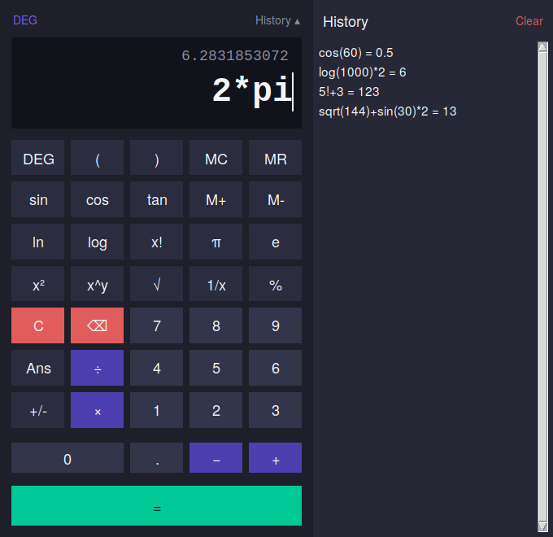

# 🧮 Scientific Calculator (Python + Tkinter)

A fast, stable, good-looking scientific calculator built with **nothing but
the Python standard library**. No `pip install`, no external packages —
clone the repo and run it on Windows, macOS, or Linux with just Python.

Built by **Saurav Kushwaha** while learning AI/ML & software engineering
fundamentals (CSE — AI & ML, 1st year).



---

## ✨ Features

- **All standard arithmetic** — `+ − × ÷ % ( )`, with automatic closing of
  unbalanced parentheses so a forgotten `)` never breaks your calculation.
- **Scientific functions** — `sin cos tan asin acos atan sinh cosh tanh`,
  `log ln log2`, `sqrt cbrt`, `exp`, `x² x^y`, `1/x`, `n!` (factorial),
  `|x|`.
- **DEG / RAD toggle** for every trig function.
- **Constants** — `π` and `e`, one tap away.
- **Memory register** — `MC` `MR` `M+` `M-`.
- **Full calculation history** — toggle a side panel, double-click any past
  result to reuse it.
- **`Ans`** — instantly reuse your previous result in a new expression.
- **Live result preview** as you type, before you even press `=`.
- **Complete keyboard support** — type numbers/operators normally, `Enter`
  to evaluate, `Backspace` to edit, `Esc`/`Delete` to clear.
- **Never crashes** — divide by zero, `log` of a negative number, garbled
  syntax, absurdly large exponents... every failure mode is caught and
  shown as a friendly inline message instead of an ugly traceback.
- **Secure by design** — the calculator does **not** call Python's
  `eval()`/`exec()` on what you type. Every expression is parsed into an
  Abstract Syntax Tree and walked against an explicit whitelist of
  operators, functions, and constants, so it behaves like a calculator,
  never like an arbitrary code interpreter.

## 🖥️ Requirements

- Python **3.8+**
- `tkinter` — included with almost every standard Python install.
  - Windows / macOS (python.org installer): already included.
  - Linux, if missing: `sudo apt install python3-tk` (Debian/Ubuntu) or
    the equivalent for your distro.

No `pip install` needed — the project has **zero third-party
dependencies**.

## 🚀 Running it

### Option 1 — Browser download, no terminal needed (easiest)

1. On this repository's GitHub page, click the green **Code** button →
   **Download ZIP**.
2. Extract the ZIP anywhere on your computer.
3. Open a terminal in that extracted folder and run:
   ```bash
   python scientific_calculator.py
   ```

### Option 2 — Git clone (terminal, requires Git installed)

```bash
git clone https://github.com/authorsauravkushwaha/scientific-calculator.git
cd scientific-calculator
python scientific_calculator.py
```

*(General habit for any repo, not just this one: the green **Code**
button on a repository's GitHub page always shows you the correct URL to
copy — that's the safest source of truth if you're ever unsure.)*

### Option 3 — Download straight from the terminal, no Git needed

GitHub lets you fetch any repository as a plain ZIP over HTTP, so you can
grab it with `curl`/`Invoke-WebRequest` alone — handy on a server, in
WSL, or anywhere Git isn't installed.

**macOS / Linux:**
```bash
curl -L -o calculator.zip https://github.com/authorsauravkushwaha/scientific-calculator/archive/refs/heads/main.zip
unzip calculator.zip
cd scientific-calculator-main
python3 scientific_calculator.py
```

**Windows PowerShell:**
```powershell
Invoke-WebRequest -Uri "https://github.com/authorsauravkushwaha/scientific-calculator/archive/refs/heads/main.zip" -OutFile "calculator.zip"
Expand-Archive -Path "calculator.zip" -DestinationPath "."
cd scientific-calculator-main
python scientific_calculator.py
```

Two things that trip people up the first time:
- The extracted folder is named `<repo>-<branch>`
  (`scientific-calculator-main`), **not** `scientific-calculator` — that
  `-main` suffix comes from the branch name, not a typo. If your repo's
  default branch is `master` instead of `main` (older repos sometimes
  are), use `master` in the URL and expect
  `scientific-calculator-master` instead.
- If `unzip` isn't found on Linux, install it first:
  `sudo apt install unzip` (Debian/Ubuntu) or the equivalent for your
  distro. Windows' `Expand-Archive` needs no extra install.

> ⚠️ **Heads up for anyone reusing this pattern on their own repo:** a
> command containing literal placeholder text — like `<your-username>`
> or `OWNER` — is *not* a real address, and copy-pasting it as-is will
> fail (a `git clone` with a placeholder gives an HTTP 400; a `curl`/
> `Invoke-WebRequest` with one gives a 404). Always substitute the real
> GitHub username, or copy the real link from the green **Code** button
> on the actual repository page, instead of typing a templated URL from
> a tutorial or README by hand.

That's it — the GUI window opens immediately.

## 🧪 Running the tests

The core calculation logic is fully unit-tested and has **no GUI
dependency**, so the test suite runs anywhere (including CI, like GitHub
Actions) with no display required:

```bash
python -m unittest test_engine.py -v
```

40 tests covering arithmetic, scientific functions, DEG/RAD mode, memory,
history, number formatting, and — importantly — a dedicated `Security`
test class confirming the evaluator rejects attribute access, imports,
unknown functions, and other tricks that would work against a naive
`eval()`-based calculator.

## 📁 Project structure

```
scientific-calculator/
├── scientific_calculator.py   # Tkinter GUI (presentation layer only)
├── calculator_engine.py       # Pure-Python calculation core (no GUI import)
├── test_engine.py             # Unit tests for calculator_engine.py
├── screenshot.png
├── requirements.txt
├── LICENSE
└── README.md
```

The GUI and the calculation logic are deliberately kept in separate
files. `calculator_engine.py` has zero knowledge of tkinter, which means:

- You can reuse `CalculatorEngine` in a CLI tool, a Discord bot, a web
  backend, etc., with no changes.
- The logic can be unit-tested in full, in milliseconds, without opening
  a single window.

## 🔒 How expressions are evaluated safely

A lot of "calculator in Python" tutorials just call `eval(user_input)`.
That's a serious security problem the moment the input could ever come
from outside your own keyboard — a string like `"().__class__.__base__..."`
can be used to reach arbitrary Python internals through `eval()`.

This project instead:

1. Parses the text with `ast.parse(expr, mode="eval")`.
2. Walks the resulting tree **node by node**, allowing only:
   - numeric literals,
   - `+ - * / % **` and unary `+ -`,
   - calls to an explicit whitelist of one-argument math functions
     (`sin`, `sqrt`, `log`, `factorial`, ...),
   - the names `pi`, `e`, `tau`, `ans`.
3. Rejects everything else — attribute access, subscripting, imports,
   string literals, lambdas, comprehensions, multi-argument calls — with
   a clear `CalculatorError` instead of executing it.

See the `TestSecurity` class in `test_engine.py` for concrete examples of
inputs that are safely rejected.

## ⌨️ Keyboard shortcuts

| Key            | Action              |
|----------------|---------------------|
| `0`–`9`, `.`   | Type digits         |
| `+ - * / ( )`  | Type operators      |
| `^`            | Inserts `**` (power)|
| `Enter`        | Evaluate (`=`)      |
| `Backspace`    | Delete last char    |
| `Esc` / `Delete` | Clear everything  |

## 🛣️ Possible future improvements

- Unit conversion mode
- Graphing mode for simple `f(x)` plots
- Persisting history to disk between sessions
- Copy-result-to-clipboard button

Contributions and suggestions are welcome — feel free to open an issue or
a pull request.

## 📄 License

Released under the [MIT License](LICENSE) — use it, learn from it, modify
it, ship it.

---

*This project is part of my AI/ML learning journey — building real,
working software from scratch instead of only following tutorials.*
